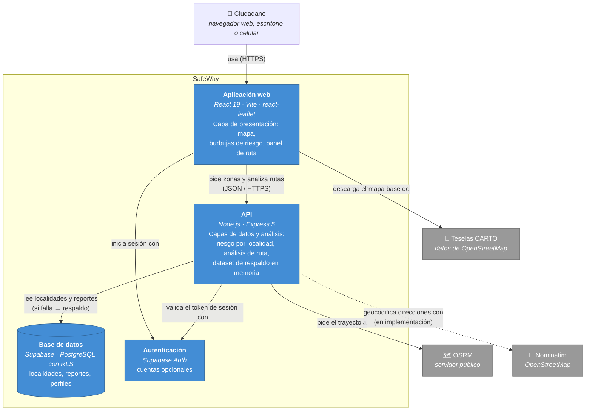

# Contenedores (C4 · nivel 2)

**Para quién:** quien va a escribir código en SafeWay. Cada caja es algo que se despliega y se
puede apagar por separado. Las tres capas del documento
([ADR-001](adr/ADR-001-tres-capas.md)) se reparten así.

## Reglas que salen de este diagrama

1. **La aplicación web no lee datos de la base directamente.** Todo dato de riesgo pasa por la
   API. A Supabase solo le habla para la sesión. (Regla R3 de `tools/verificar-capas.js`.)
2. **Dentro de la API**, `src/routes/` solo maneja HTTP y `src/services/` tiene la lógica y el
   acceso a datos: las rutas no hablan con Supabase (R1) y los servicios no importan Express (R2).
3. **El dataset de respaldo vive dentro de la API** (`Backend/src/data/localities.js`), no es un
   contenedor aparte: si la base de datos cae, la API sigue respondiendo
   ([ADR-002](adr/ADR-002-supabase-con-respaldo.md)).
4. **Llamadas a servicios externos** (base de datos, OSRM, Nominatim): siempre con timeout y con
   una respuesta de respaldo declarada en la respuesta (`localitySource`, `routeSource`). Hoy el
   respaldo existe pero **falta el timeout** en las tres: si el servicio se cuelga en vez de
   fallar, la API espera.

## Despliegue previsto

Aplicación web en Vercel · API en Render · Supabase en su capa gratuita (documento, sección
VII.D). Hoy solo corre en local.
