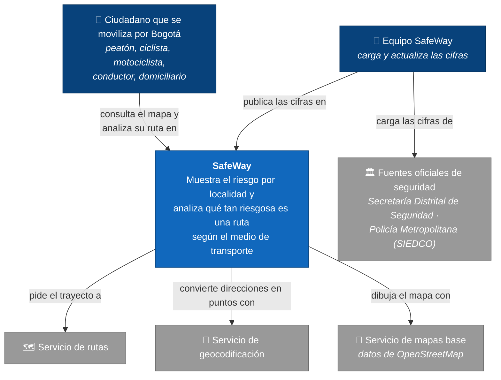

# Contexto (C4 · nivel 1)

**Para quién:** el docente, un evaluador o cualquiera que llegue sin saber nada. Sin tecnologías:
qué es SafeWay, quién lo usa y de qué depende. El detalle técnico está en
[contenedores.md](contenedores.md).

## Qué dice este diagrama

- **SafeWay no se conecta en vivo a las fuentes oficiales.** El equipo las descarga, las limpia y
  las carga (la integración en vivo está fuera del alcance de esta versión). Por eso el dato tiene
  fecha de corte y la app la muestra.
- **Depende de tres servicios externos gratuitos** (rutas, geocodificación y mapas). Ninguno
  tiene garantía de servicio; cuando el de rutas falla, SafeWay usa la línea recta y lo dice
  ([ADR-004](adr/ADR-004-servicios-publicos-osm.md)).
- **No es un canal de emergencia**: no se conecta con la Línea 123 ni con la Policía.

## Fuera de este diagrama (fuera de alcance)

Integración en vivo con fuentes oficiales · detalle por barrio o por tramo de vía · aplicaciones
móviles nativas · cobertura fuera de Bogotá.
